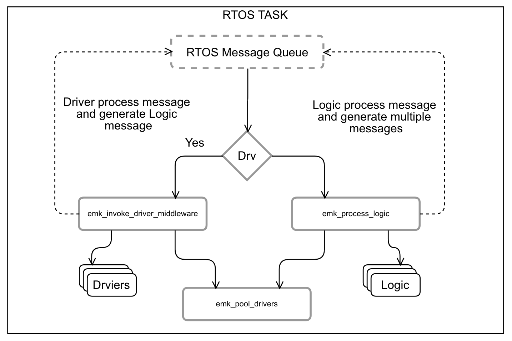

# esp-mqtt-kit

esp-mqtt-kit is a platform to make IoT automation projects easier. It uses well-defined logic blocks, which exchange with messages to build robust applications.

esp-mqtt-kit is a Free-RTOS ESP8266 based application. It consists of the following pieces:
 - Ingestor - a logic block which process IRQ, pool ESP hardware/GPIO or MQTT to generate messages.
 - [Actuator](./docs/Actuators.md) - a logic block which receive messages and send it through MQTT or interact with ESP hardware/GPIO
 - Logic - well-defined blocks which transform messages, set timers, repeaters, work with state and persistent configuration parameters.

Ingestors, Actuators, and Logic are worked inside isolated scopes called Groups. Each group might handle different situations. For instance, if device is controlled remotely through Node-Red logic, it might use Group0 to forward MQTT messages straight to the Actuators and Ingestor messages back to MQTT.

If a device goes offline, or MQTT is not available, the logic might activate Group1, which will have more sophisticated but rigid logic to safely operate with the device, for instance, heat pump or ventilation system.

Here is a simple overview of the app architecture:

 

## Ideology

ESP8266 chips and devices are pretty cheap. You can use a lot of them to build your automation project. You do not need to have a central unit such as a PC or Raspberry Pi to control the entire system.

Having no central unit means to have no single point of failure. Of course, except network, WiFi, internet connection if you use Amazon IoT or central MQTT message broker. But those are optional.

In case of the network/MQTT failure, all your devices will still be controlled by esp-mqtt-kit instances and can gracefully reduce functionality, switch to the failsafe mode and provide just basic services.

The opposite is true. Failure of one of the ESP8266 modules should not be critical for the entire system.

## Architecture

Akka Play framework was an inspiration for the model. There are no callbacks, multithreading, locking or interrupt handlings. Every communication happens through messages.

Hardware interaction abstracted on an Actuator/Ingestor level through drivers, which generate messages. Those messages might be delivered straight to the MQTT and be processed by the external logic system such as Node-Red. Or you might compose your own logic using provided logic blocks to handle pretty complex logic internally and use MQTT to report status, receive external commands or get external sensor messages (temperature, humidity, etc).

