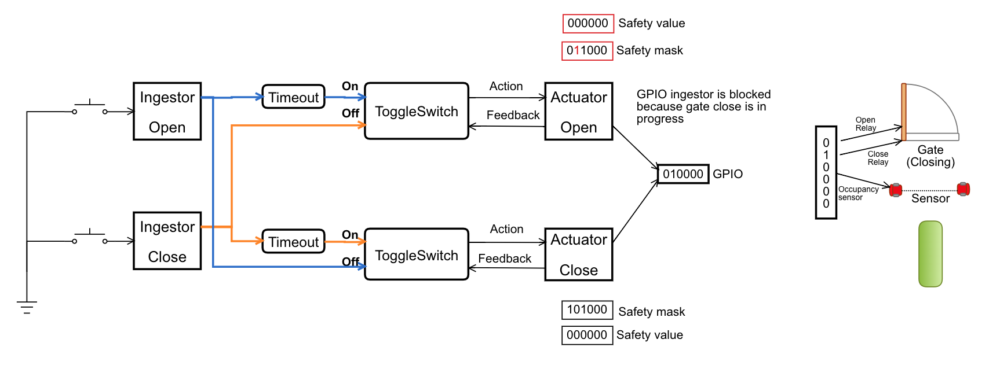

# Actuator

An actuator is a logic block which converts the input message to the MCU peripheral action, such as GPIO output, PWM set up, i2c communication and others.

## [Actuator types](#actuator-types)
 - `ACTUATOR_TYPE_GPIO` - A GPIO actuator. Set MCU GPIO outputs according to the message value

## Actuator Configuration Parameters

 - _const char*_ name - Actuator name. Used while console output and debugging.

 - _emk_actuator_type_t_ type - [Actuator type](#actuator-types).

 - _const emk_address_t*_ address - Actuator address. A message delivered to that address will trigger actuator execution.

 - _const emk_address_t*_ status_address - An address which will be used to send back message.

 - _uint32_t_ initial_status_timeout - A timeout of the initial status advertizing. Use `DISABLE_INITIAL_NOTIFICATION_TIMEOUT` as a value to prevent initial status dispatching.

 - _const void*_ config - Actuator specific configuration

## GPIO Actuator

GPIO actuator receives a message and set correspondent GPIO port value to the message value. If not specified otherwise, GPIO actuator report back GPIO set status. Each actuator has `initial_status_timeout` parameter which controls a timeout in milliseconds where initial GPIO status should be sent. A `DISABLE_INITIAL_NOTIFICATION_TIMEOUT` value is used to disable the initial GPIO status report.

If the GPIO actuator has `status_address` set, every time the GPIO actuator receives a message, a status message will be sent back. However, a message might not be sent in 2 cases:

 - GPIO bits masked with `safety_mask` does not match `safety_value`. This is used as an additional protection measure not to turn on or off any devices mutually incompatible. Imagine a motor with open and close rotation direction. If both relays are on, it might damage the motor.

 - A `GPIO_ACTUATOR_NOFEEDBACK` bit is set to the message data. This bit is used with timeout messages. This flag depends on your current system design.

 ## GPIO Actuator Configuration Values

 - _uint8_t_ gpio - A GPIO port number

 - _uint8_t_ initial_state - Initial GPIO state

 - _uint8_t_ safety_mask - A mask to be applied to the gpio_read() result

 - _uint8_t_ safety_value - A gpio_read() & safety_mask should match safety_value in order to set new GPIO value. If it does not, GPIO actuator will not send any feedback. Console warn message will appear.

 Please note that `safety_mask` and `safety_value` are not intended to be used as a part of the regular flow. It's a protection feature against bugs in your code not to fry devices and/or cause a fire or other damage.

 If you're using `ToggleSwith` logic block as a state block, consider using `Timeout` block to delay command propagation. This will guarantee, that neither Open nor Close actions will not be executed in a wrong order and safety mask/value silently reject your command.

 